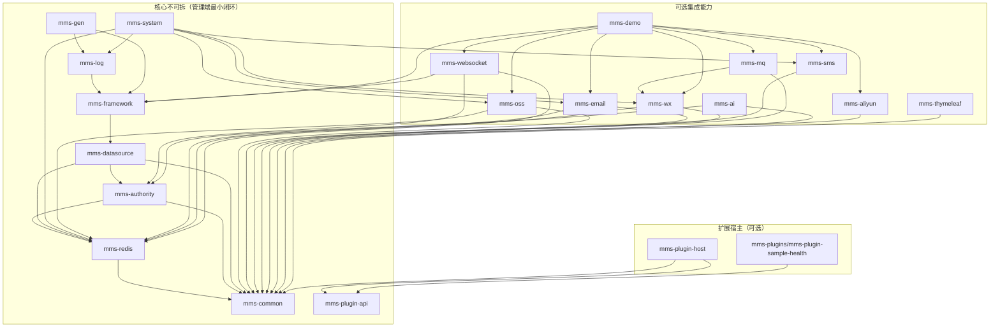

# v1-20260331 脚手架回归与扩展基线

> 本文作为 **BUG 冒烟 / 性能压测 / 插件与 SaaS 扩展** 的共识基线；与主仓、`mms-doc`、子模块 `mms-ui` 同步迭代。

---

## 1. mms-modules 依赖 DAG（Maven 依赖边）

**说明**

- **核心不可拆**：自 **mms-common** 经 **authority → datasource → framework**，再到 **log / gen** 与 **system**；管理端 `mms-api-admin` 依赖 **gen + system**（及 **mms-plugin-host** 等可选）。去掉 **system / gen / framework / datasource** 任一侧链，管理端无法正常业务运行。
- **可选集成**：**oss / sms / email / wx / mq / websocket / aliyun / ai / thymeleaf / demo** 及 **mms-plugin-host**、示例 JAR **mms-plugins/mms-plugin-sample-health**（独立构建，不随 admin 打包）。

**ClassLoader 插件 vs 进程级**

| 方式 | 优点 | 缺点 |
|------|------|------|
| **进程内 URLClassLoader（当前实现）** | 热试、与宿主同 JVM、运维接口可视 | 卸载不彻底、Spring MVC 需后续动态注册、多版本依赖易冲突 |
| **独立进程 / Sidecar** | 隔离好、技术栈自由 | 运维复杂、与 Sa-Token / 租户上下文需 RPC 对齐 |
| **仅重启换 fatjar / lib** | 实现简单、无 ClassLoader 泄漏顾虑 | 无「热」体验 |

**结论**：当前采用 **ClassLoader + SPI**；生产环境 **安装/升级后重启** 仍推荐为终极手段。

---

## 2. BUG 基线：冒烟用例清单

| 编号 | 场景 | 步骤要点 | 期望 |
|------|------|-----------|------|
| S1 | 租户关闭 | `tenant.enable=false` 启动，登录业务表 CRUD | 无 tenant 行条件异常；登录不按租户套餐校验 |
| S2 | 租户开启 | `tenant.enable=true`，两租户各建一笔业务数据 | 列表查询互不串数据 |
| S3 | 租户过期 | `sys_tenant.expire_time` 设为过去 | 登录失败，提示过期相关文案 |
| S4 | 租户套餐停用 | `sys_tenant.package_id` 指向 status≠启用 的套餐 | 登录失败 |
| S5 | 登录 | `POST system/auth/login` 正确账密 + 租户 | 返回 token，Redis ADMIN_* 写入 |
| S6 | 菜单 | 登录后 `GET common/getMenu` | 返回菜单树 |
| S7 | 代码生成 | 打开生成页，`POST gen/table/list`（或导入表后列表） | 200，分页结构正常 |
| S8 | 文件上传 | 走已有 OSS/本地上传接口 | 成功返回可访问路径或 id |
| S9 | 插件关闭 | `mms.plugin.enabled=false` | `/system/pluginHost/status` 中 enabled=false，列表可空 |
| S10 | 插件开启 | 构建 `mms-plugins/mms-plugin-sample-health`，放入 `lib/`，`enabled=true` 启动 | `status` 含插件；`GET .../health` 有 `NO_HEALTH_SPI` 或 JSON 样例行 |
| S11 | 插件安装 API | super_admin `multipart` `POST .../install` 上传示例 JAR + reload | `lib/` 出现文件且可加载 |

---

## 3. 性能基线：建议压测接口 + 慢 SQL

**接口（3～5 个，高优先级）**

1. `POST /system/auth/login` — 登录基线（低并发即可对比优化前后）。
2. `GET /common/getMenu` — 每次进首页/刷新菜单。
3. `POST /system/user/list` — 典型分页（带租户时鉴权 + SQL）。
4. `POST /gen/table/list` — 代码生成表列表。
5. `POST /system/oss/list` 或实际上传热点接口 — 对应文件链路。

**工具建议**：JMeter / k6；配合 **p6spy** 或 MySQL `slow_query_log` 截取 **>200ms** SQL，重点看是否缺索引、`tenant_id` 组合条件、分页深翻页。

**慢 SQL 自查**：`sys_user`、`sys_function` 菜单树、`gen_table` 大表全表扫；按环境用 `EXPLAIN` 记录一次基线。

---

## 4. 与文档 / Skill 的对应

- **能力矩阵（表格式）**：主仓 **`.cursor/skills/mms-scaffold-phases/SKILL.md` §7**（不再发布 `mms-doc` 独立页面）。
- **租户、插件、子模块表对外文档**：`mms-doc` → `index/introduction.md`（`mms-modules` 表）、`mms-ui/plugin-route-protocol.md`、`mms-admin/plugin-jar-phases.md`、`mms-admin/plugin-develop.md`、`mms-admin/saas-tenant-gap.md` 等。
- **Cursor**：`.cursor/skills/mms-modules-map`、`mms-scaffold-phases`、`mms-kills` 内「模块与依赖 DAG」指向本文与上述页面。

---

*文档版本：2026-03-31*
